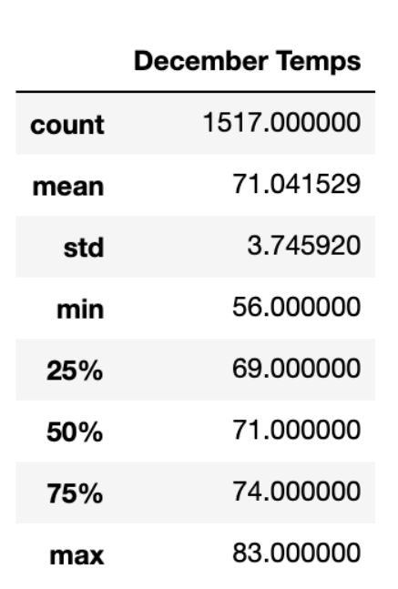

# surfs_up
## Overview
In this report, we have filtered out the temperature data of June and December in Oahu from 2010 to 2017 to determind the surfs and ice cream trends based on the temperature information. We would represent the details of temperature information and conlcusions based on the result.
## Results
### Temperature information 
|June temperature                                  | December temperature                                    |
|:----------:                                      |                           :------------------:          |
|                                |                                        |
As we can see from above two images, the average temperature of June is about 74.9 F and the average temperature of December is about 71.04 F. We can come up with the following results:
* Even though the lowest temperatue showed in June is 64 F , the overall temperature in June is higher than it in December.
* The average temperature of June is 4 F higher than it in December.
* The standard deviation of temperature in June is smaller than it in December which means that the temperature in June is more stable.

## Summary
Overall, the temperature in Oahu is relatively stable and it would not change so much comparing the results in June and December. As the average temperature in June and December are 74.9F and 71.04F, we can say that Oahu is a ideal place for summer business like surfs and ice cream business. For a better data analysis, we would make data queries about the weather (if the sun is out) and the wind speed for the consideration of people feelings. For instance, if the wind speed is large and it is a cloudy day, people would still feel cold with temperature of 64F and the ocean waves might be too dangerous to surf. With all of the data, we could make better analysis for our business. 

